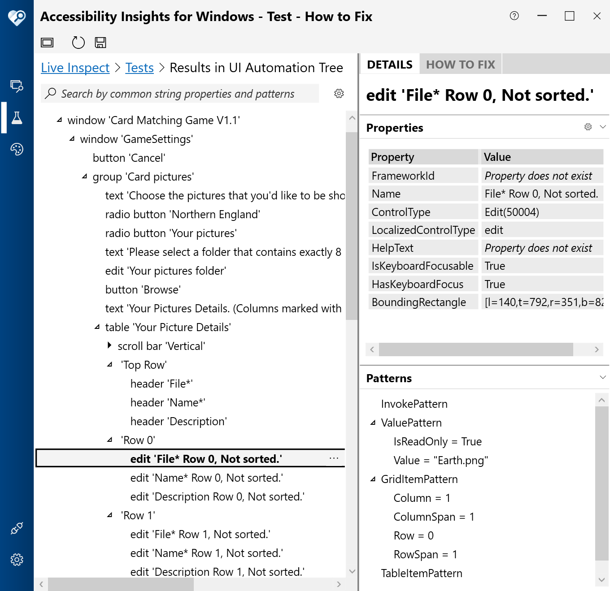

# WinFormsMatchingGame

**Goals**

The goals of this app are to (1) demonstrate some considerations and implementation relating to a simple, accessible Windows game app, and (2) make an enjoyable game available for everyone.

&nbsp;

**Playing the game**

The game is based on a traditional card matching game, where face-down cards are turned over in the hope of finding pairs of cards.

When the game is run, a 4x4 grid of blank squares appears, each square representing a card. When a card is clicked, an image is shown on the card. When another card is clicked, an image is also shown on that second card. If the two images are the same, then the cards are considered to be matched, and will not change again for the rest of the game. If the images do not match, then the cards are considered to be unmatched, and the "Turn cards back over" button must be clicked, which results in the two unmatched cards no longer showing images. These steps are to be repeated until all matching images have been found, and a "Congratulations" window appears.

The following image shows the game showing two pairs of matched cards and one pair of unmatched cards.

&nbsp;

&nbsp;

From Version 1.2 of the game, players can select one set of their own 8 pictures to be used. Each picture must be accompanied by a name, and optionally a description, for players using screen readers to access.

From Version 1.3 of the game, players can import and export the accessible names and descriptions associated with a set of pictures. By default, the accessible names and descriptions supplied get saved to a file called "MatchingGamePictureDetails.txt" in the same folder that contains the pictures. 

The following image shows the Settings window in the game, with pictures and text relating to the planets of the Solar System.

&nbsp;

&nbsp;

**Keyboard**

Tab key presses move keyboard focus between the grid and the buttons shown in the app. To move keyboard focus between the cards inside the grid, use the arrow keys. To turn two unmatched cards back over, either press Alt+B or the Enter key.

&nbsp;

**Speech**

To click one of the cards shown in the app using speech input, say "Click Card" followed by the number of the card. The cards are numbered from 1 to 16, reading left to right then top to bottom. For example, to click the first card on the bottom row, say "Click card 13".

The following image shows two pairs of matched cards and one pair of unmatched cards. Above the game is the Windows Speech Recognition feature showing "Clicking Card 10, Face down"

&nbsp;

&nbsp;

**Technical considerations while building V1.0 of the app**

By default, when building games for everyone to play, it's best to leverage standard controls which come with the UI framework being used to build the app. Typically standard controls have built-in support for some level of accessibility, and so they provide a great head start when building an accessible app. So the first question is, what would be the most appropriate WinForms control to use for the grid of cards?

Well, given that the game is basically a grid of cards, one option that seemed attractive was to use a DataGridView control. That control presents a grid of cells, and supports keyboard accessibility, fundamental programmatic accessibility of its cells (with some level of customization), and also programmatically exposes the row and column data associated with the grid and each cell. As such, the DataGridView seemed to have great potential as a starting point for the grid shown in the game. 

Typically a DataGridView control has its data bound, with each data item representing a single row in the grid. So the game app here could have a data item containing the data for all cells on a single row. For this early version of the game app however, given that each cell is independent of all other cells, data binding isn't used. Rather, internally a separate list of card data is managed independently of the grid, and that list's data is accessed however necessary when working with the grid. In later versions of the game, I expect data binding will be used.

Perhaps it might turn out that at some point another control seems a more attractive option for presenting the cards in the game. For example, using a ListView with a View property of LargeIcon can visually provide a grid which is keyboard accessible, programmatically accessible, and it's simple to have each item in the list bound to some data. One reason why the ListView control is not currently being used in the app today is because it doesn't seem to support the UIA Grid pattern when showing a grid of icons. As such, a cell in the grid doesn't programmatically expose its row and column data like a cell in a DataGridView control does.

The next question is what type of DataGridView cells are the best match for the cards in the game? Given that images are to be shown in the cells, it was tempting to use DataGridViewImageCell. That would make it really easy to have images shown, and to specify how the images are to be presented. However, in tests, it didn't seem that the DataGridViewImageCell responded to attempts to click the cell with the keyboard or through speech input. So instead, the DataGridView in the game uses the DataGridViewButtonCell. That type of cell responds to a click using mouse, touch, keyboard and speech, and so provides a great head start on supporting all players. The only apparent disadvantage of using the DataGridViewButtonCell here is that it doesn't seem to natively support displaying an image. As such, the DataGridView in the game has its CellPainting overridden, and manual action is taken to present the image on a card.

I was prompted to build this game after finding an inaccessible card matching game. One of the ways in which that app was inaccessible was its use of hard-coded timeouts. Face-up cards would automatically be turned over after a short period, which means that in practice some players would not have access to the information temporarily being shown. At some point, I might add use of a timeout, but if I do, players must be completely in control of the timeout, including having the option to have no timeout at all. Rather than me adding a hard-coded timeout now, with a claim that I'll make it configurable later, I chose to have no timeouts in this early version of the app. This means that when anything happens in the game, it's because the player chose to make it happen.

The game does in some situations raise programmatic events, requesting that screen readers make custom game-specific announcements. I would expect it would be preferable for these announcements to be made configurable, and so hopefully feedback from players can help the game's announcements become more useful. Currently, game-specific announcements are made in the following cases:

1. A click is made on any card when two unmatched cards are already showing.
2. A card is turned over and matches another card that's already face-up.
3. Two face-up unmatched cards are turned back over.

By default, I would say that the names of cards in the game should never change. For example, a card might have a name of "Card 1" or "Card 8", and its name would not change based on whether it’s face-up or face-down. Any current state data associated with the card would be programmatically exposed through other properties, such as its value. However, given that a card's value might not be announced due to a screen reader's current settings, and the image shown on the card is always essential when playing the game, that data is currently incorporated into the card's name. Feedback would be appreciated as to how all the data associated with a card would be most helpfully exposed to screen readers.

The Description property of a class derived from DataGridViewButtonCellAccessibleObject does not get exposed through the Windows UI Automation (UIA) API as UIA clients would expect it to, so that property is not overridden in the app. Rather, the Help property is used to describe the image shown on a card, and that gets exposed through the UIA HelpText property.

The following image shows the Accessibility Insights for Windows tool reporting the UI Automation hierarchy of the grid cells shown in the game.

&nbsp;

&nbsp;

**Technical considerations while building V1.1 of the app**

A Settings window was introduced in V1.1 of the game, so that players can provide one set of their own 8 pictures. Below are some of the considerations that went into adding the Settings window.

Instructions related to the selection of pictures are shown as labels on the window. This reduces the chances that players select a number of pictures, or types of pictures, that the game doesn't handle. Having instructions missing, or hidden away as tooltips somewhere, will make the game more frustrating to use.

Column headers in the picture table relating to columns where data is required, are marked with an asterisk. A label near the column headers explains the meaning of an asterisk in the table.

All focusable controls in the window have unique keyboard shortcuts.

By default, do not customize the standard WinForms controls in the window. By never setting custom colours anywhere, the controls will respect the player's choice of theme colours. By never overriding keyboard input, default actions will behave as expected. For example, F3 to change the sort order of the Your Picture Details grid when keyboard focus is in the grid.

Details relating to keyboard input at the grid are at [Default keyboard and mouse handling in the Windows Forms DataGridView control](https://docs.microsoft.com/en-us/dotnet/desktop/winforms/controls/default-keyboard-and-mouse-handling-in-the-windows-forms-datagridview-control?view=netframeworkdesktop-4.8&viewFallbackFrom=netdesktop-5.0). 

If the Settings window is canceled after changes have been made, always query the player to make sure they're ok with the changes being lost. It's very easy for an Escape key to be pressed or a Cancel button to be clicked by accident.

If required data is missing when the Save and Close button is clicked, present a message to be clear about what data is missing, and then move keyboard focus over to a control which needs updating.

I decided not to show a preview of the pictures in the grid, as the preview would be too small for to be useful to many people.

By default, the accessible names of the TextBox and DataGridView controls are taken from the labels that precede those controls. In the case of this Settings window, the preceding labels' text is not the best match for the accessible names of the TextBox and DataGridView controls. As such, more appropriate accessible names have been explicitly set on those controls.

Whenever controls are added, removed, or rearranged in the Settings window, Accessibility Insights for Windows is run to verify that the UIA order of elements is as players need it to be. If the order is not as expected, the calls to Add() in the Settings window's Designer file were reordered as necessary, in order to create the required UIA order in the form and in the containers within the form. While editing the Designer file, all explicit setting of TabIndex is manually removed from the code. The TabIndex will be added back as required later by Visual Studio.

The following image shows the Accessibility Insights for Windows tool reporting the UI Automation hierarchy of the elements in the Settings window. The programmatic order of the elements matches the visual order shown in the window.

&nbsp;

&nbsp;

It is assumed here that the WinForms FolderBrowserDialog is fully accessible, but I've not verified that myself.

For coding convenience, the grid uses a hidden column to store the full file path for the player's picture files. While that column data is not exposed through UIA, the column indices for all the columns after that column are increased by 1. This may cause some confusion for players using screen readers, as it gives the impression that there's a column somewhere in the grid which is inaccessible to them. 

I couldn't find a way to have cells which are required, be exposed through UIA as having a IsRequiredForForm property of true.

I couldn't find a way to change the width of columns using only the keyboard.

As I understand things, the DataGridView doesn't support the HideSelection property like the ListView control does. This means the current cell in the grid looks almost identical when the grid has keyboard focus and when it doesn't. I'd say this degrades the usage of the Settings window, so I may look into adding custom code which changes the visuals for the current cell when the grid doesn't have keyboard focus.

&nbsp;

**Technical considerations while building Version 1.3 of the app**

A feature in a game is not helpful at all to players if the players don't know that the feature's there. In Version 1.3 of the game, instructions for keyboard use are shown on the main app window. Also, a message now appears when a player attempts to turn up a card when two unmatched cards are already face up. Previously the app gave not response to such an attempt. The goal with all these changes has been to make it much clearer as to how to play the game, using only the UI and behaviours provided directly by the game.

The Restart button has been removed, and replaced with a Restart menu item whose shortcut key is F5. This is to make the game more consistent with other apps which support the F5 key as a "Restart" action.

Traditionally some desktop apps struggle with low resolution support. They may claim to have a responsive design because their main window adapts to changing resolutions. But then they also have fixed sized dialogs which don't fit at the same low resolution that's supported by the main window.

Personal note: I have strong memories of the above problem when helping my aunt work at her laptop at a low screen resolution. Some dialog in an app on her laptop had a bunch of controls clipped off the bottom of the screen, and the clipping happened in such a way that it wasn't obvious that the clipping had occurred. That was a very poor customer experience.

In Version 1.3 of the game, a resolution of 1024x768 is supported by both the main window and Settings dialog. I'll continue to consider how the app might support lower resolutions still. If players prefer larger visuals to be shown in the game, a low resolution screen can be used in combination with a magnifier.

&nbsp;

&nbsp;

**Technical resources**

The following resources show code snippets relating to customizing the accessibility of DataGridView cells.
- [WinForms: Setting the accessible name of a DataGridView cell](https://docs.microsoft.com/en-us/accessibility-tools-docs/items/WinForms/DataItem_Name) 
- [WinForms: Setting helpful supplemental information on a DataGridView cell](https://docs.microsoft.com/en-us/accessibility-tools-docs/items/WinForms/DataItem_HelpText) 
- [WinForms: Setting a value on a DataGridView cell](https://docs.microsoft.com/en-us/accessibility-tools-docs/items/WinForms/DataItem_ValueValue) 

For other technical accessibility resources relating to WinForms and other Windows UI Frameworks, please visit 
[Common approaches for enhancing the programmatic accessibility of your Win32, WinForms and WPF apps](https://www.linkedin.com/pulse/common-approaches-enhancing-programmatic-your-win32-winforms-barker)

&nbsp;

**To run the app without building it**

The app's available at the Microsoft Store for people who aren't set up to build the app themselves. To run this app, following the steps below. This exe will only run on a 64-bit version of Windows.

1. Download the app from the Microsoft store at [Accessible Matching Game](https://www.microsoft.com/store/apps/9P6KHLZJF7C7).
2. If .NET 5 is not yet installed on your computer, you will be prompted to install it when the app is run. The required version is .NET 5 for x64 Windows Desktop and its download link is [.NET 5 for x64 Desktop](https://dotnet.microsoft.com/en-us/download/dotnet/thank-you/runtime-desktop-5.0.12-windows-x64-installer).

&nbsp;

**Known Issues**

If an image shown on a card contains some transparency, then the card's graphics get messed up if the mouse is used to resize the main window. Minimizing and restoring the main window gets the card's graphics looking right again.

&nbsp;

**Future improvements**

Please provide feedback on how the app could be made more accessible to yourself or people you know. I'll try my best to update it accordingly. Thanks for your help!

