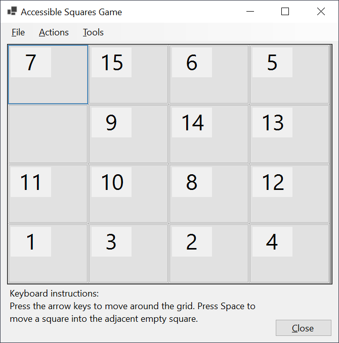
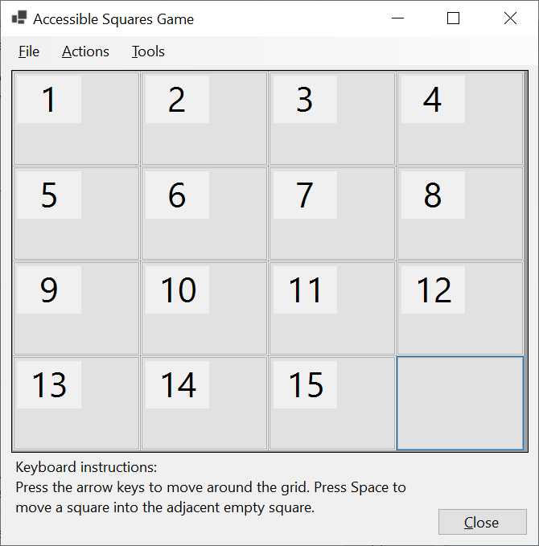

# WinFormsSquaresGame

**Goals**

The goals of this app are to (1) demonstrate some considerations and implementation relating to a simple, accessible Windows game app, and (2) make an enjoyable game available for everyone.

&nbsp;

**Playing the game**

The game is based on a square sliding game, where squares in a grid of squares are rearranged by the player to form an ordered sequence in the grid.

When the game is run, a 4x4 grid of squares appears, with 15 of those squares occupied with an movable element, and 1 square being empty. When a square is clicked, if it is adjacent to the empty square, the clicked square moves into the empty square. The space where the clicked square was then becomes the empty square. The aim is to arrange all the squares in a sorted order, leaving the empty square in the bottom right corner of the grid.

If the game setting to have numbers shown on the square is on, then a number is shown in the top left corner of the squares. The sorted order is for the numbers to start at 1, and increase from let to right and top to bottom. 

The following image shows the numbered squares jumbled when the game starts.

&nbsp;

&nbsp;

The following image shows the numbered squares arranged in the sorted order.

&nbsp;

&nbsp;

The Settings window can be used to toggle the visibility of the numbers on the squares, and also change the size of the numbers shown. Also, players can select a picture to be shown on all the squares in the grid. When the squares are ordered, the picture appears in its true state.

The following image shows the numbered squares jumbled when the game starts, with a picture selected.

&nbsp;

&nbsp;

The following image shows the numbered squares with a picture selected arranged in the sorted order.

&nbsp;

&nbsp;

**Keyboard**

Press the arrow keys to move keyb oard focus around the grid. Press Space to move a square into the adjacent empty square.

&nbsp;

**Speech**

To click one of the squares shown in the app using speech input, say "Click" followed by the number of the square.

&nbsp;

**Technical notes**

The accessible name of a square is same as the number shown on the square.

The following image shows the Accessibility Insights for Windows tool reporting the Windows UI Automation (UIA) hierarchy of the jumbled squares in the grid.

&nbsp;

&nbsp;

The following image shows the Accessibility Insights for Windows tool reporting the Windows UI Automation (UIA) hierarchy of the ordered squares in the grid.

&nbsp;

&nbsp;

**Technical resources**

The following resources show code snippets relating to customizing the accessibility of DataGridView cells.
- [WinForms: Setting the accessible name of a DataGridView cell](https://docs.microsoft.com/en-us/accessibility-tools-docs/items/WinForms/DataItem_Name) 
- [WinForms: Setting helpful supplemental information on a DataGridView cell](https://docs.microsoft.com/en-us/accessibility-tools-docs/items/WinForms/DataItem_HelpText) 
- [WinForms: Setting a value on a DataGridView cell](https://docs.microsoft.com/en-us/accessibility-tools-docs/items/WinForms/DataItem_ValueValue) 

For other technical accessibility resources relating to WinForms and other Windows UI Frameworks, please visit 
[Common approaches for enhancing the programmatic accessibility of your Win32, WinForms and WPF apps](https://www.linkedin.com/pulse/common-approaches-enhancing-programmatic-your-win32-winforms-barker)

&nbsp;

**Future improvements**

Please provide feedback on how the app could be made more accessible to yourself or people you know. I'll try my best to update it accordingly. Thanks for your help!

